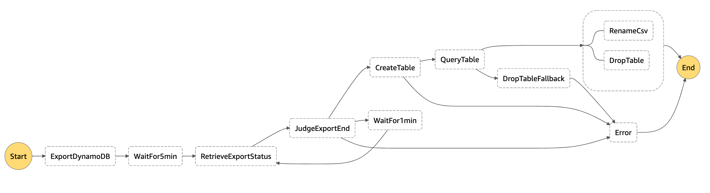

# DynamoDB to CSV

Extract CSV from Amazon DynamoDB table with "Exporting DynamoDB table data to Amazon S3" and Amazon Athena.
Support large CSV ( < 15 GB ).

## Overview

Following processes are executed step by step using AWS StepFunctions.



1. "**ExportDynamoDB**" : Export "DynamoDB JSON" to S3 bucket.
2. "**WaitFor5min**" : Wait for completing to export for 5 min. (It's takes usual over 5 min.)
3. "**RetrieveExportStatus**" : Retrieve exporting status.
4. "**JudgeExportEnd**" : If needed, wait for 1 min, And then back to above 3. step.
5. "**CreateTable**" : Create Athena's table from exported JSON.
6. "**QueryTable**" : Execute select query on created table and then a single csv file that is query result is created on S3 bucket.
7. "**RenameCsv**" : Rename and move csv file and if needed compress. Rename supports `strftime` format.
8. "**DropTable**" : Drop table that is created when above 5. step.

## Benefits

* **No cunsume DynamoDB capacity** : The feature "Exporting DynamoDB table data to Amazon S3" does not consume DynamoDB capacity.
* **Pay as you go** : Because of serverless architecture, you pay as you go.

## Components

This project contains source code and supporting files for a serverless application that you can deploy with the SAM CLI. It includes the following files and folders.

- lambda-export-ddb - Code for Lambda function that is to export DynamoDB JSON from DynamoDB table using PITR (Point in Time Recovery).
- lambda-rename-compress-csv - Code for Lambda function that is to rename exported csv file and compress it.
- lambda-rename-csv - Code for Lambda function that is only to rename exported csv file.
- lambda-retrieve-status - Code for Lambda function that is to retrieve exporting status.
- statemachine - Code for Step Functions DSL (Amazon States Language).
- template.yaml - A template that defines the application's AWS resources.

## Pre-Requriement

1. To enable "Point In Time Recovery" on your target DynamoDB table.
2. S3 buckets for 3 purposes what to export JSON, to output CSV and to rename CSV. You can use the same bucket for all three.
3. Athena database.

## Deploy the sample application

The Serverless Application Model Command Line Interface (SAM CLI) is an extension of the AWS CLI that adds functionality for building and testing Lambda applications. It uses Docker to run your functions in an Amazon Linux environment that matches Lambda. It can also emulate your application's build environment and API.

To use the SAM CLI, you need the following tools.

* SAM CLI - [Install the SAM CLI](https://docs.aws.amazon.com/serverless-application-model/latest/developerguide/serverless-sam-cli-install.html)
* [Python 3 installed](https://www.python.org/downloads/)
* Docker - [Install Docker community edition](https://hub.docker.com/search/?type=edition&offering=community)

To build and deploy your application for the first time, run the following in your shell:

```bash
sam build --use-container
sam deploy --guided
```

The first command will build the source of your application. The second command will package and deploy your application to AWS, with a series of prompts:

* **Stack Name**: The name of the stack to deploy to CloudFormation. This should be unique to your account and region, and a good starting point would be something matching your project name.
* **AWS Region**: The AWS region you want to deploy your app to.
* Parameter
  * **DynamoDBTableName**: Export target DynamoDB table name. (default: `table-name`)
  * **DynamoDBSchema**: DynamoDB JSON schema for `CREATE TABLE` by Athena. (default: pk:struct<S:string>,field0:struct<S:string>,field1:struct<N:string>)
  * **ExportS3Bucket**: S3 bucket name for exported JSON file from DynamoDB. (default: `your-bucket`)
  * **ExportS3Prefix**: S3 prefix for exported JSON file from DynamoDB. (default: `dynamodb/export`)
  * **OutputCsvS3Bucket**: S3 bucket name for query result output by Athena. (default: `your-bucket`)
  * **OutputCsvS3Prefix**: S3 prefix for query result output by Athena. (defualt: `ddb2csv`)
  * **RenameCsvS3Bucket**: S3 bukcet name for renamed csv file from the Output. (default: `your-bucket`)
  * **RenameCsvS3PrefixFormat**: S3 prefix for renamed csv file from the Output. It's allowd to specify strftime format. (default: `dst/%Y/%m/%d/%H`)
  * **RenameCsvTimezoneForPrefixFormat**: Timezone for above S3 prefix strftime format (default: `UTC` / example: `Asia/Tokyo`)
  * **RenameCsvFileName**: Renamed CSV file name. (default: `exported.csv`)
  * **CompressCsv**: `true` is enable to compress renamed csv file. (default: `false`)
  * **AthenaDatabase**: Athena database name. (default: `default`)
  * **AthenaTemporaryTable**: Athena temporary table name to execute query. This table is droped when process is complete. (default: `ddb2csb_exported`)
  * **AthenaQueryFields**: Query fields used by Athena `SELECT` query. (default: `Item.pk.S as pk, Item.field0.S as field0, Item.field1.N as field1`)
  * **LogLevel**: Log level for Python Lambda (DEBUG, INFO, WARNING, ERROR, CRITICAL) (default: WARNING)
* **Confirm changes before deploy**: If set to yes, any change sets will be shown to you before execution for manual review. If set to no, the AWS SAM CLI will automatically deploy application changes.
* **Allow SAM CLI IAM role creation**: Many AWS SAM templates, including this example, create AWS IAM roles required for the AWS Lambda function(s) included to access AWS services. By default, these are scoped down to minimum required permissions. To deploy an AWS CloudFormation stack which creates or modified IAM roles, the `CAPABILITY_IAM` value for `capabilities` must be provided. If permission isn't provided through this prompt, to deploy this example you must explicitly pass `--capabilities CAPABILITY_IAM` to the `sam deploy` command.
* **Save arguments to samconfig.toml**: If set to yes, your choices will be saved to a configuration file inside the project, so that in the future you can just re-run `sam deploy` without parameters to deploy changes to your application.

## Cleanup

To delete the sample application that you created, use the AWS CLI. Assuming you used your project name for the stack name, you can run the following:

```bash
aws cloudformation delete-stack --stack-name ${STACK_NAME}
```